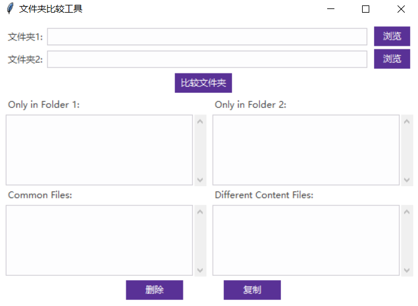

**English | [简体中文](README_cn.md)**
<div id="top"></div>

[![Contributors][contributors-shield]][contributors-url]
[![Forks][forks-shield]][forks-url]
[![Stargazers][stars-shield]][stars-url]
[![Issues][issues-shield]][issues-url]
[![License][license-shield]][license-url]


<!-- PROJECT LOGO -->
<br />
<div align="center">
    <a href="https://github.com/MoonGrt/Python-Tool">
    
    </a>
<h3 align="center">Python-Tool</h3>
    <p align="center">
    The Python tool repository contains various practical Python programs designed to improve efficiency in file management, image processing, and data analysis tasks.
    <br />
    <a href="https://github.com/MoonGrt/Python-Tool"><strong>Explore the docs »</strong></a>
    <br />
    <a href="https://github.com/MoonGrt/Python-Tool">View Demo</a>
    ·
    <a href="https://github.com/MoonGrt/Python-Tool/issues">Report Bug</a>
    ·
    <a href="https://github.com/MoonGrt/Python-Tool/issues">Request Feature</a>
    </p>
</div>


<!-- CONTENTS -->
<details open>
  <summary>Contents</summary>
  <ol>
    <li><a href="#file-tree">File Tree</a></li>
    <li>
      <a href="#about-the-project">About The Project</a>
      <ul>
      </ul>
    </li>
    <li><a href="#contributing">Contributing</a></li>
    <li><a href="#license">License</a></li>
    <li><a href="#contact">Contact</a></li>
    <li><a href="#acknowledgments">Acknowledgments</a></li>
  </ol>
</details>


<!-- FILE TREE -->
## File Tree

```
└─ Project
  ├─ LICENSE
  ├─ README.md
  ├─ /File_Format/
  │ ├─ File_Format.py
  │ └─ Indent_converter.py
  ├─ /Folder_Diff/
  │ └─ Folder_Diff.py
  ├─ /images/
  ├─ /Image_Process/
  │ ├─ /Color_Replace/
  │ │ ├─ Color_Replace1.py
  │ │ └─ Color_Replace2.py
  │ ├─ /Image_Flip/
  │ │ └─ Image_Flip.py
  │ └─ /Image_Resize/
  │   ├─ Image_Resize.py
  │   ├─ Image_Resize_GUI.py
  │   └─ README.md
  ├─ /MC_Playerdata_Integration/
  │ └─ data_integration.py
  ├─ /Text_Replace/
  │ └─ Text_Replace.py
  └─ /Web_Scraper/
    ├─ mooyuu.py
    ├─ netbian.py
    ├─ pivix.py
    └─ spider.py
```


<!-- ABOUT THE PROJECT -->
## About The Project

<p style=" margin-top:0px; margin-bottom:0px; margin-left:0px; margin-right:0px; -qt-block-indent:0; text-indent:0px;">The Python tool repository features a collection of compact and powerful Python programs designed for file management, image processing, and data analysis. These tools aim to simplify common tasks and improve operational efficiency, making them suitable for developers and data handlers. The repository covers a wide range of functionalities, from code formatting to web scraping.</p>
<p style="-qt-paragraph-type:empty; margin-top:0px; margin-bottom:0px; margin-left:0px; margin-right:0px; -qt-block-indent:0; text-indent:0px; font-weight:600;"><br /></p>
<p style=" margin-top:0px; margin-bottom:0px; margin-left:0px; margin-right:0px; -qt-block-indent:0; text-indent:0px;"><span style=" font-weight:600;">File_Format</span>: An efficient code formatting tool supporting multiple programming languages such as C, C++, Java, and Verilog. It allows for uniform formatting of individual files or entire directories, ensuring consistency and readability in codebases. This tool is particularly useful for projects requiring large-scale code standardization.</p>
<p align="center" style=" margin-top:0px; margin-bottom:0px; margin-left:0px; margin-right:0px; -qt-block-indent:0; text-indent:0px;"></p>
<p style="-qt-paragraph-type:empty; margin-top:0px; margin-bottom:0px; margin-left:0px; margin-right:0px; -qt-block-indent:0; text-indent:0px;"><br /></p>
<p style=" margin-top:0px; margin-bottom:0px; margin-left:0px; margin-right:0px; -qt-block-indent:0; text-indent:0px;"><span style=" font-weight:600;">Folder_Diff</span>: A folder comparison tool that thoroughly compares the contents of two directories and generates a detailed difference report. It identifies identical files, different files, and files unique to each folder, making it ideal for file synchronization, backup validation, and codebase change management. This helps users quickly identify discrepancies and track changes between versions.</p>
<p align="center" style=" margin-top:0px; margin-bottom:0px; margin-left:0px; margin-right:0px; -qt-block-indent:0; text-indent:0px;"></p>
<p style="-qt-paragraph-type:empty; margin-top:0px; margin-bottom:0px; margin-left:0px; margin-right:0px; -qt-block-indent:0; text-indent:0px;"><br /></p>
<p style=" margin-top:0px; margin-bottom:0px; margin-left:0px; margin-right:0px; -qt-block-indent:0; text-indent:0px;"><span style=" font-weight:600;">Image_Process</span>: A comprehensive set of image processing tools, including Color_Replace (replacing specific colors in images with user-defined colors), Image_Flip (supports vertical and horizontal image flipping), and Image_Resize (offers image resizing using various algorithms). These tools are highly suitable for batch image processing and customized image modifications, catering to diverse image editing and optimization needs.</p>
<p align="center" style=" margin-top:0px; margin-bottom:0px; margin-left:0px; margin-right:0px; -qt-block-indent:0; text-indent:0px;"></p>
<p style="-qt-paragraph-type:empty; margin-top:0px; margin-bottom:0px; margin-left:0px; margin-right:0px; -qt-block-indent:0; text-indent:0px;"><br /></p>
<p align="center" style=" margin-top:0px; margin-bottom:0px; margin-left:0px; margin-right:0px; -qt-block-indent:0; text-indent:0px;"></p>
<p style="-qt-paragraph-type:empty; margin-top:0px; margin-bottom:0px; margin-left:0px; margin-right:0px; -qt-block-indent:0; text-indent:0px;"><br /></p>
<p align="center" style=" margin-top:0px; margin-bottom:0px; margin-left:0px; margin-right:0px; -qt-block-indent:0; text-indent:0px;"></p>
<p style="-qt-paragraph-type:empty; margin-top:0px; margin-bottom:0px; margin-left:0px; margin-right:0px; -qt-block-indent:0; text-indent:0px;"><br /></p>
<p style=" margin-top:0px; margin-bottom:0px; margin-left:0px; margin-right:0px; -qt-block-indent:0; text-indent:0px;"><span style=" font-weight:600;">Text_Replace</span>: A batch text replacement tool capable of replacing specified content across numerous files or entire directories. It supports not only simple string replacements but also more complex multi-pattern text transformations, making it ideal for large-scale document processing and code refactoring.</p>
<p align="center" style=" margin-top:0px; margin-bottom:0px; margin-left:0px; margin-right:0px; -qt-block-indent:0; text-indent:0px;"></p>
<p style="-qt-paragraph-type:empty; margin-top:0px; margin-bottom:0px; margin-left:0px; margin-right:0px; -qt-block-indent:0; text-indent:0px;"><br /></p>
<p style=" margin-top:0px; margin-bottom:0px; margin-left:0px; margin-right:0px; -qt-block-indent:0; text-indent:0px;"><span style=" font-weight:600;">Web_Scraper</span>: A powerful web scraping tool that automatically extracts and organizes data from specified websites. It supports parsing complex web structures, making it suitable for data collection, market analysis, content monitoring, and other use cases where automated extraction of web information is required.</p>
<p style=" margin-top:0px; margin-bottom:0px; margin-left:0px; margin-right:0px; -qt-block-indent:0; text-indent:0px;"><span style=" font-weight:600;">MC_Playerdata_Integration</span>: A Minecraft-specific data integration tool designed to merge player data from multiple users. It analyzes and combines data to generate reports or statistics, facilitating easier data management and sharing for players. This tool is particularly useful for server administrators and players in the Minecraft community, offering deeper insights into player activities and server performance.</p></body></html>
<p align="right">(<a href="#top">top</a>)</p>


<!-- CONTRIBUTING -->
## Contributing

Contributions are what make the open source community such an amazing place to learn, inspire, and create. Any contributions you make are **greatly appreciated**.
If you have a suggestion that would make this better, please fork the repo and create a pull request. You can also simply open an issue with the tag "enhancement".
Don't forget to give the project a star! Thanks again!
1. Fork the Project
2. Create your Feature Branch (`git checkout -b feature/AmazingFeature`)
3. Commit your Changes (`git commit -m 'Add some AmazingFeature'`)
4. Push to the Branch (`git push origin feature/AmazingFeature`)
5. Open a Pull Request
<p align="right">(<a href="#top">top</a>)</p>


<!-- LICENSE -->
## License

Distributed under the MIT License. See `LICENSE` for more information.
<p align="right">(<a href="#top">top</a>)</p>


<!-- CONTACT -->
## Contact

MoonGrt - 1561145394@qq.com
Project Link: [MoonGrt/Python-Tool](https://github.com/MoonGrt/Python-Tool)

<p align="right">(<a href="#top">top</a>)</p>


<!-- ACKNOWLEDGMENTS -->
## Acknowledgments

* [Choose an Open Source License](https://choosealicense.com)
* [GitHub Emoji Cheat Sheet](https://www.webpagefx.com/tools/emoji-cheat-sheet)
* [Malven's Flexbox Cheatsheet](https://flexbox.malven.co/)
* [Malven's Grid Cheatsheet](https://grid.malven.co/)
* [Img Shields](https://shields.io)
* [GitHub Pages](https://pages.github.com)
* [Font Awesome](https://fontawesome.com)
* [React Icons](https://react-icons.github.io/react-icons/search)
<p align="right">(<a href="#top">top</a>)</p>


<!-- MARKDOWN LINKS & IMAGES -->
<!-- https://www.markdownguide.org/basic-syntax/#reference-style-links -->
[contributors-shield]: https://img.shields.io/github/contributors/MoonGrt/Python-Tool.svg?style=for-the-badge
[contributors-url]: https://github.com/MoonGrt/Python-Tool/graphs/contributors
[forks-shield]: https://img.shields.io/github/forks/MoonGrt/Python-Tool.svg?style=for-the-badge
[forks-url]: https://github.com/MoonGrt/Python-Tool/network/members
[stars-shield]: https://img.shields.io/github/stars/MoonGrt/Python-Tool.svg?style=for-the-badge
[stars-url]: https://github.com/MoonGrt/Python-Tool/stargazers
[issues-shield]: https://img.shields.io/github/issues/MoonGrt/Python-Tool.svg?style=for-the-badge
[issues-url]: https://github.com/MoonGrt/Python-Tool/issues
[license-shield]: https://img.shields.io/github/license/MoonGrt/Python-Tool.svg?style=for-the-badge
[license-url]: https://github.com/MoonGrt/Python-Tool/blob/master/LICENSE

