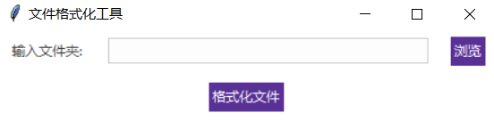
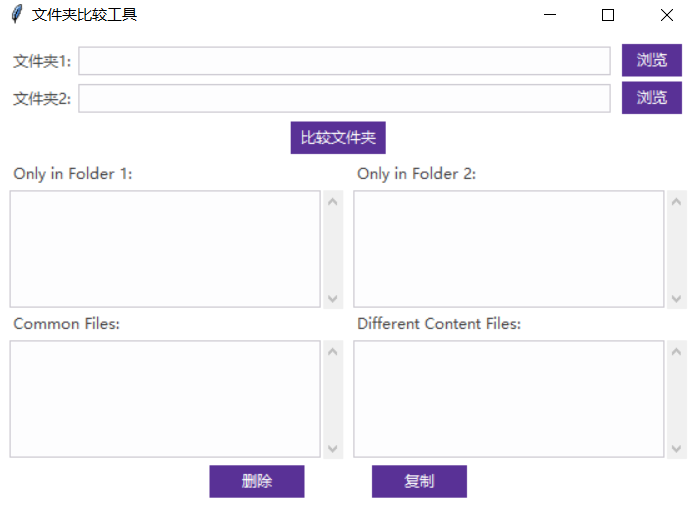
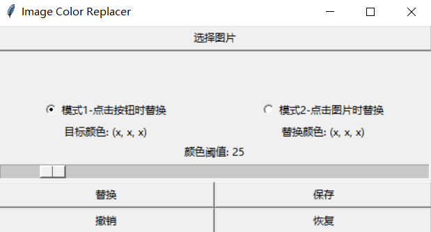
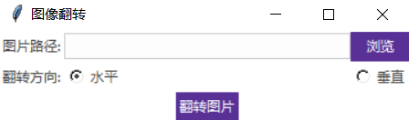
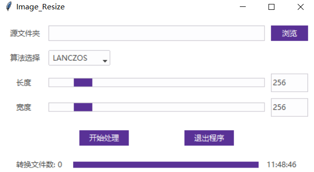
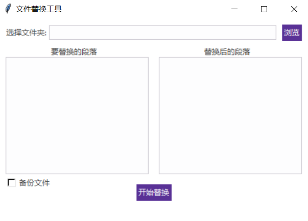

**简体中文 | [English](README.md)**
<div id="top"></div>

[![Contributors][contributors-shield]][contributors-url]
[![Forks][forks-shield]][forks-url]
[![Stargazers][stars-shield]][stars-url]
[![Issues][issues-shield]][issues-url]
[![License][license-shield]][license-url]


<!-- PROJECT LOGO -->
<br />
<div align="center">
    <a href="https://github.com/MoonGrt/Python-Tool">
    
    </a>
<h3 align="center">Python-Tool</h3>
    <p align="center">
    Python工具仓库收集了多个实用的小型Python软件，涵盖文件处理、图像处理、数据分析等功能，旨在提升开发效率和简化任务操作。
    <br />
    <a href="https://github.com/MoonGrt/Python-Tool"><strong>Explore the docs »</strong></a>
    <br />
    <a href="https://github.com/MoonGrt/Python-Tool">View Demo</a>
    ·
    <a href="https://github.com/MoonGrt/Python-Tool/issues">Report Bug</a>
    ·
    <a href="https://github.com/MoonGrt/Python-Tool/issues">Request Feature</a>
    </p>
</div>


<!-- CONTENTS -->
<details open>
  <summary>目录</summary>
  <ol>
    <li><a href="#文件树">文件树</a></li>
    <li>
      <a href="#关于本项目">关于本项目</a>
      <ul>
      </ul>
    </li>
    <li><a href="#贡献">贡献</a></li>
    <li><a href="#许可证">许可证</a></li>
    <li><a href="#联系我们">联系我们</a></li>
    <li><a href="#致谢">致谢</a></li>
  </ol>
</details>


<!-- 文件树 -->
## 文件树

```
└─ Project
  ├─ LICENSE
  ├─ README.md
  ├─ /File_Format/
  │ ├─ File_Format.py
  │ └─ Indent_converter.py
  ├─ /Folder_Diff/
  │ └─ Folder_Diff.py
  ├─ /images/
  ├─ /Image_Process/
  │ ├─ /Color_Replace/
  │ │ ├─ Color_Replace1.py
  │ │ └─ Color_Replace2.py
  │ ├─ /Image_Flip/
  │ │ └─ Image_Flip.py
  │ └─ /Image_Resize/
  │   ├─ Image_Resize.py
  │   ├─ Image_Resize_GUI.py
  │   └─ README.md
  ├─ /MC_Playerdata_Integration/
  │ └─ data_integration.py
  ├─ /Text_Replace/
  │ └─ Text_Replace.py
  └─ /Web_Scraper/
    ├─ mooyuu.py
    ├─ netbian.py
    ├─ pivix.py
    └─ spider.py
```


<!-- 关于本项目 -->
## 关于本项目

<p style=" margin-top:0px; margin-bottom:0px; margin-left:0px; margin-right:0px; -qt-block-indent:0; text-indent:0px;">Python工具仓库集合了多款专注于文件处理、图像处理和数据分析的小型实用软件。各工具功能强大，旨在简化常见任务、提高操作效率，适用于开发者和数据处理人员，涵盖从代码格式化到网页数据抓取的多方面应用。</p>
<p style="-qt-paragraph-type:empty; margin-top:0px; margin-bottom:0px; margin-left:0px; margin-right:0px; -qt-block-indent:0; text-indent:0px; font-weight:600;"><br /></p>
<p style=" margin-top:0px; margin-bottom:0px; margin-left:0px; margin-right:0px; -qt-block-indent:0; text-indent:0px;"><span style=" font-weight:600;">File_Format</span>: 一款高效的代码格式化工具，支持C、C++、Java、Verilog等多种编程语言。无论是单个文件还是整个文件夹中的代码，都可以通过该工具进行统一的格式化处理，保证代码风格的一致性和可读性，特别适合需要大规模代码规范化的项目。</p>
<p align="center" style=" margin-top:0px; margin-bottom:0px; margin-left:0px; margin-right:0px; -qt-block-indent:0; text-indent:0px;"></p>
<p style="-qt-paragraph-type:empty; margin-top:0px; margin-bottom:0px; margin-left:0px; margin-right:0px; -qt-block-indent:0; text-indent:0px;"><br /></p>
<p style=" margin-top:0px; margin-bottom:0px; margin-left:0px; margin-right:0px; -qt-block-indent:0; text-indent:0px;"><span style=" font-weight:600;">Folder_Diff</span>: 文件夹内容对比工具，可详细比较两个文件夹中的文件，并生成差异报告。结果包括相同文件、不同文件、文件夹1中特有的文件以及文件夹2中特有的文件。该工具适用于文件同步、备份验证和代码库变更管理，帮助用户快速识别文件差异。</p>
<p align="center" style=" margin-top:0px; margin-bottom:0px; margin-left:0px; margin-right:0px; -qt-block-indent:0; text-indent:0px;"></p>
<p style="-qt-paragraph-type:empty; margin-top:0px; margin-bottom:0px; margin-left:0px; margin-right:0px; -qt-block-indent:0; text-indent:0px;"><br /></p>
<p style=" margin-top:0px; margin-bottom:0px; margin-left:0px; margin-right:0px; -qt-block-indent:0; text-indent:0px;"><span style=" font-weight:600;">Image_Process</span>: 一个全面的图像处理工具集合，包含Color_Replace（替换图像中特定颜色为用户自定义颜色），Image_Flip（支持上下或左右翻转图像），以及Image_Resize（提供基于多种算法的图像尺寸调整）。这些工具非常适合批量图像处理和自定义图像修改，满足用户在图像编辑和优化中的多样需求。</p>
<p align="center" style=" margin-top:0px; margin-bottom:0px; margin-left:0px; margin-right:0px; -qt-block-indent:0; text-indent:0px;"></p>
<p style="-qt-paragraph-type:empty; margin-top:0px; margin-bottom:0px; margin-left:0px; margin-right:0px; -qt-block-indent:0; text-indent:0px;"><br /></p>
<p align="center" style=" margin-top:0px; margin-bottom:0px; margin-left:0px; margin-right:0px; -qt-block-indent:0; text-indent:0px;"></p>
<p style="-qt-paragraph-type:empty; margin-top:0px; margin-bottom:0px; margin-left:0px; margin-right:0px; -qt-block-indent:0; text-indent:0px;"><br /></p>
<p align="center" style=" margin-top:0px; margin-bottom:0px; margin-left:0px; margin-right:0px; -qt-block-indent:0; text-indent:0px;"></p>
<p style="-qt-paragraph-type:empty; margin-top:0px; margin-bottom:0px; margin-left:0px; margin-right:0px; -qt-block-indent:0; text-indent:0px;"><br /></p>
<p style=" margin-top:0px; margin-bottom:0px; margin-left:0px; margin-right:0px; -qt-block-indent:0; text-indent:0px;"><span style=" font-weight:600;">Text_Replace</span>: 文本替换工具，支持在大量文件或整个文件夹中批量替换指定内容。该工具不仅可以进行简单的字符串替换，还适合进行复杂的多模式文本替换，是大规模文档处理和代码重构的理想选择。</p>
<p align="center" style=" margin-top:0px; margin-bottom:0px; margin-left:0px; margin-right:0px; -qt-block-indent:0; text-indent:0px;"></p>
<p style="-qt-paragraph-type:empty; margin-top:0px; margin-bottom:0px; margin-left:0px; margin-right:0px; -qt-block-indent:0; text-indent:0px;"><br /></p>
<p style=" margin-top:0px; margin-bottom:0px; margin-left:0px; margin-right:0px; -qt-block-indent:0; text-indent:0px;"><span style=" font-weight:600;">Web_Scraper</span>: 一个强大的网页数据爬取工具，能够自动从指定的网站中抓取内容并整理数据。该工具支持对复杂网页结构的解析，适用于数据采集、市场分析、内容监控等场景，帮助用户快速提取网页中的关键信息。</p>
<p style=" margin-top:0px; margin-bottom:0px; margin-left:0px; margin-right:0px; -qt-block-indent:0; text-indent:0px;"><span style=" font-weight:600;">MC_Playerdata_Integration</span>: 适用于Minecraft游戏玩家的数据整合工具，专为整合多个用户的游戏数据设计。它能够分析并融合不同用户的数据，生成整体报告或统计结果，方便玩家进行数据管理和共享。这款工具对Minecraft社区的服务器管理员和玩家特别有用，能够提供更深层次的数据洞察。</p></body></html>
<p align="right">(<a href="#top">top</a>)</p>


<!-- 贡献 -->
## 贡献

贡献让开源社区成为了一个非常适合学习、互相激励和创新的地方。你所做出的任何贡献都是**受人尊敬**的。

如果你有好的建议，请复刻（fork）本仓库并且创建一个拉取请求（pull request）。你也可以简单地创建一个议题（issue），并且添加标签「enhancement」。不要忘记给项目点一个 star！再次感谢！

1. 复刻（Fork）本项目
2. 创建你的 Feature 分支 (`git checkout -b feature/AmazingFeature`)
3. 提交你的变更 (`git commit -m 'Add some AmazingFeature'`)
4. 推送到该分支 (`git push origin feature/AmazingFeature`)
5. 创建一个拉取请求（Pull Request）
<p align="right">(<a href="#top">top</a>)</p>


<!-- 许可证 -->
## 许可证

根据 MIT 许可证分发。打开 [LICENSE](LICENSE) 查看更多内容。
<p align="right">(<a href="#top">top</a>)</p>


<!-- 联系我们 -->
## 联系我们

MoonGrt - 1561145394@qq.com
Project Link: [MoonGrt/Python-Tool](https://github.com/MoonGrt/Python-Tool)

<p align="right">(<a href="#top">top</a>)</p>


<!-- 致谢 -->
## 致谢

在这里列出你觉得有用的资源，并以此致谢。我已经添加了一些我喜欢的资源，以便你可以快速开始！

* [Choose an Open Source License](https://choosealicense.com)
* [GitHub Emoji Cheat Sheet](https://www.webpagefx.com/tools/emoji-cheat-sheet)
* [Malven's Flexbox Cheatsheet](https://flexbox.malven.co/)
* [Malven's Grid Cheatsheet](https://grid.malven.co/)
* [Img Shields](https://shields.io)
* [GitHub Pages](https://pages.github.com)
* [Font Awesome](https://fontawesome.com)
* [React Icons](https://react-icons.github.io/react-icons/search)
<p align="right">(<a href="#top">top</a>)</p>


<!-- MARKDOWN LINKS & IMAGES -->
<!-- https://www.markdownguide.org/basic-syntax/#reference-style-links -->
[contributors-shield]: https://img.shields.io/github/contributors/MoonGrt/Python-Tool.svg?style=for-the-badge
[contributors-url]: https://github.com/MoonGrt/Python-Tool/graphs/contributors
[forks-shield]: https://img.shields.io/github/forks/MoonGrt/Python-Tool.svg?style=for-the-badge
[forks-url]: https://github.com/MoonGrt/Python-Tool/network/members
[stars-shield]: https://img.shields.io/github/stars/MoonGrt/Python-Tool.svg?style=for-the-badge
[stars-url]: https://github.com/MoonGrt/Python-Tool/stargazers
[issues-shield]: https://img.shields.io/github/issues/MoonGrt/Python-Tool.svg?style=for-the-badge
[issues-url]: https://github.com/MoonGrt/Python-Tool/issues
[license-shield]: https://img.shields.io/github/license/MoonGrt/Python-Tool.svg?style=for-the-badge
[license-url]: https://github.com/MoonGrt/Python-Tool/blob/master/LICENSE

